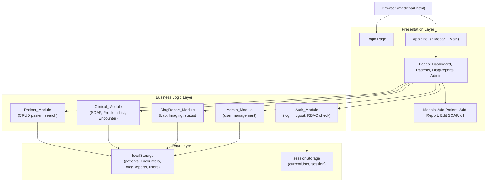
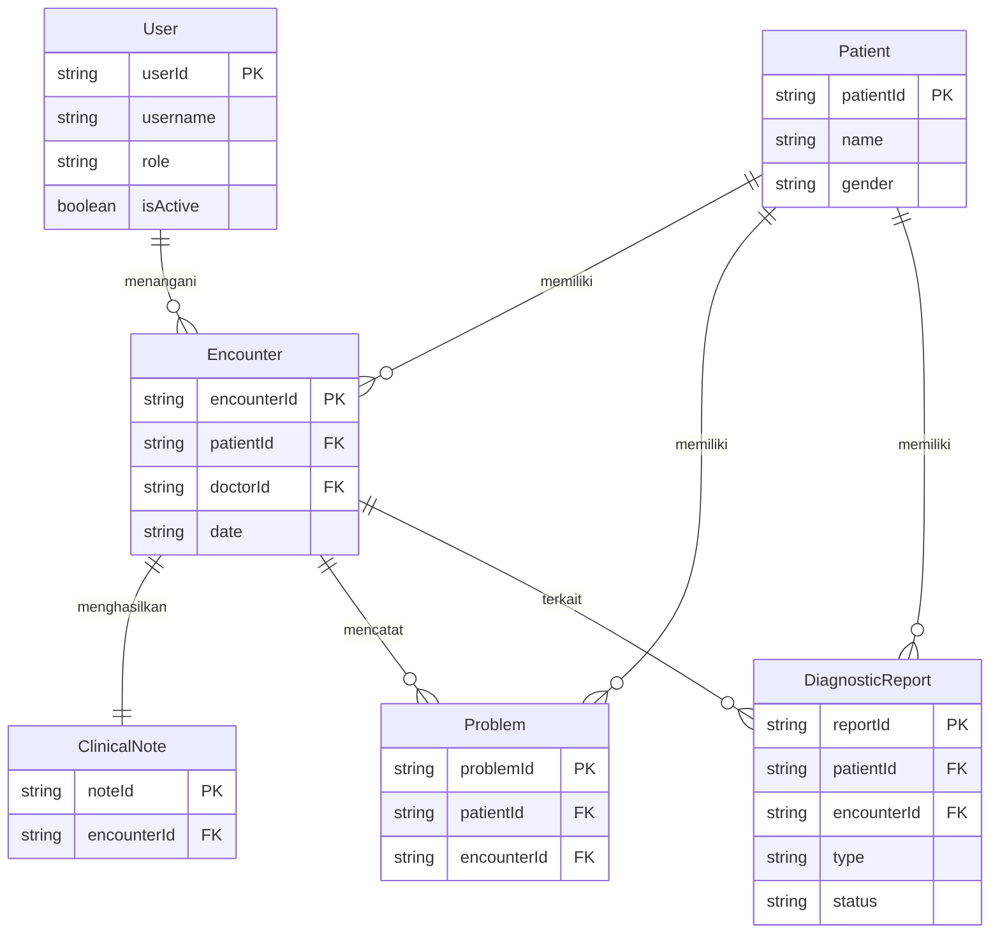

# Design Document — MediChart EMR v2

## Overview

MediChart EMR v2 adalah pengembangan lanjutan dari sistem rekam medis elektronik berbasis web single-page (SPA) yang dibangun dengan HTML, CSS, dan JavaScript murni tanpa framework eksternal. Versi ini memperluas sistem v0 dengan dua kategori fitur utama:

1. **Authentication & Authorization (RBAC)** — sistem login berbasis peran dengan tiga peran: Dokter, Perawat, dan Admin.
2. **Diagnostic Reports** — modul pencatatan hasil laboratorium dan radiologi/imaging yang terintegrasi dengan data klinis pasien.

Selain itu, v2 menghasilkan dokumentasi teknis lengkap (diagram UML/DFD yang diperbarui, laporan desain, README), serta mengarsipkan versi lama ke `archive/medichart-v0/`.

Sistem berjalan sepenuhnya di browser (client-side only), menggunakan `localStorage` sebagai mekanisme persistensi data dan `sessionStorage` untuk manajemen sesi login. Tidak ada server backend — semua logika bisnis diimplementasikan dalam JavaScript di satu file `medichart.html`.

### Tujuan Desain

- Mempertahankan semua fitur v0 (Patient List, Demographics, SOAP Notes, Problem List, Encounter History)
- Menambahkan RBAC yang membatasi akses fitur berdasarkan peran pengguna
- Menambahkan modul Diagnostic Reports (Lab & Imaging) yang terintegrasi dengan Encounter
- Menghasilkan dokumentasi teknis yang komprehensif
- Mempertahankan desain visual yang konsisten dengan v0

---

## Architecture

### Arsitektur Keseluruhan

Sistem menggunakan arsitektur **Single-Page Application (SPA) monolitik** — seluruh kode (HTML, CSS, JS) berada dalam satu file `medichart.html`. Tidak ada build step, bundler, atau server backend.



### Pola Navigasi

Sistem menggunakan **hash-based routing** atau **state-based view switching** — setiap "halaman" adalah sebuah `<div>` yang ditampilkan/disembunyikan berdasarkan state aktif. Tidak ada navigasi URL yang sebenarnya.

### Pola Data

Semua data disimpan di `localStorage` sebagai JSON string. Setiap koleksi data memiliki key tersendiri:

| Key localStorage | Isi |
|---|---|
| `mc_patients` | Array of Patient objects |
| `mc_encounters` | Array of Encounter objects |
| `mc_clinical_notes` | Array of ClinicalNote objects |
| `mc_problems` | Array of Problem objects |
| `mc_diag_reports` | Array of DiagnosticReport objects |
| `mc_users` | Array of User objects |

Session data disimpan di `sessionStorage`:

| Key sessionStorage | Isi |
|---|---|
| `mc_session` | Object `{ userId, username, name, role, loginAt }` |

---

## Components and Interfaces

### Auth_Module

Bertanggung jawab atas autentikasi dan otorisasi.

```
Auth_Module
├── login(username, password) → Session | null
├── logout() → void
├── getSession() → Session | null
├── isAuthenticated() → boolean
├── hasRole(role) → boolean
├── canAccess(feature) → boolean
├── requireAuth() → void  // redirect ke login jika tidak ada sesi
└── seedDemoUsers() → void  // inisialisasi akun demo
```

**Tabel Hak Akses (RBAC Matrix):**

| Fitur | Dokter | Perawat | Admin |
|---|---|---|---|
| Lihat daftar pasien | ✅ | ✅ | ✅ |
| Tambah/edit pasien | ✅ | ❌ | ✅ |
| Lihat demographics | ✅ | ✅ | ✅ |
| Input SOAP (Subjective) | ✅ | ❌ | ❌ |
| Input SOAP (Objective/Vital Signs) | ✅ | ✅ | ❌ |
| Input SOAP (Assessment & Plan) | ✅ | ❌ | ❌ |
| Problem List | ✅ | ❌ | ❌ |
| Diagnostic Reports (lihat) | ✅ | ✅ | ❌ |
| Diagnostic Reports (input/edit) | ✅ | ❌ | ❌ |
| Manajemen pengguna | ❌ | ❌ | ✅ |

### Patient_Module

Bertanggung jawab atas manajemen data pasien.

```
Patient_Module
├── getAllPatients() → Patient[]
├── getPatientById(patientId) → Patient | null
├── searchPatients(query) → Patient[]
├── addPatient(data) → Patient
├── updatePatient(patientId, data) → Patient
└── deletePatient(patientId) → void
```

### Clinical_Module

Bertanggung jawab atas catatan klinis (SOAP, Problem List, Encounter).

```
Clinical_Module
├── getEncountersByPatient(patientId) → Encounter[]
├── getEncounterById(encounterId) → Encounter | null
├── addEncounter(data) → Encounter
├── updateEncounter(encounterId, data) → Encounter
├── getClinicalNote(encounterId) → ClinicalNote | null
├── saveClinicalNote(encounterId, data) → ClinicalNote
├── getProblemsByPatient(patientId) → Problem[]
├── addProblem(data) → Problem
└── updateProblemStatus(problemId, status) → Problem
```

### DiagReport_Module

Bertanggung jawab atas laporan diagnostik (lab dan imaging).

```
DiagReport_Module
├── getReportsByPatient(patientId) → DiagnosticReport[]
├── getReportsByEncounter(encounterId) → DiagnosticReport[]
├── getReportById(reportId) → DiagnosticReport | null
├── addReport(data) → DiagnosticReport
├── updateReport(reportId, data) → DiagnosticReport
├── updateStatus(reportId, newStatus) → DiagnosticReport
├── filterByType(patientId, type) → DiagnosticReport[]
└── validateReport(data) → ValidationResult
```

### Admin_Module

Bertanggung jawab atas manajemen akun pengguna.

```
Admin_Module
├── getAllUsers() → User[]
├── getUserById(userId) → User | null
├── addUser(data) → User | ValidationError
├── updateUser(userId, data) → User
├── deactivateUser(userId) → User
└── isUsernameAvailable(username) → boolean
```

### UI Layer

Komponen UI utama:

- **LoginPage** — form login dengan validasi
- **AppShell** — sidebar navigasi + area konten utama
- **PatientListPanel** — daftar pasien dengan search
- **PatientDetailPanel** — demographics + encounter history
- **DiagReportPanel** — tab Lab/Imaging + daftar laporan + detail
- **AdminPanel** — manajemen pengguna
- **Modal System** — sistem modal generik untuk form input

---

## Data Models

### User

```javascript
{
  userId: string,          // UUID, unik
  username: string,        // unik, case-insensitive
  passwordHash: string,    // hash sederhana (untuk demo: plain text atau simple hash)
  name: string,
  role: "Dokter" | "Perawat" | "Admin",
  isActive: boolean,
  lastLoginAt: string | null  // ISO 8601 timestamp
}
```

### Session

```javascript
{
  userId: string,
  username: string,
  name: string,
  role: "Dokter" | "Perawat" | "Admin",
  loginAt: string  // ISO 8601 timestamp
}
```

### Patient

```javascript
{
  patientId: string,       // UUID, unik
  name: string,
  age: number,
  gender: "Laki-laki" | "Perempuan",
  address: string,
  phone: string,
  bloodType: string,
  allergies: string,
  createdAt: string        // ISO 8601 timestamp
}
```

### Encounter

```javascript
{
  encounterId: string,     // UUID, unik
  patientId: string,       // FK → Patient.patientId
  doctorId: string,        // FK → User.userId
  date: string,            // ISO 8601 date
  chiefComplaint: string,
  status: "open" | "closed",
  createdAt: string        // ISO 8601 timestamp
}
```

### ClinicalNote (SOAP)

```javascript
{
  noteId: string,          // UUID, unik
  encounterId: string,     // FK → Encounter.encounterId
  subjective: string,
  objective: string,       // termasuk tanda vital
  assessment: string,
  plan: string,
  updatedAt: string        // ISO 8601 timestamp
}
```

### Problem

```javascript
{
  problemId: string,       // UUID, unik
  patientId: string,       // FK → Patient.patientId
  encounterId: string,     // FK → Encounter.encounterId
  diagnosisName: string,
  icdCode: string,
  status: "active" | "resolved" | "chronic",
  createdAt: string        // ISO 8601 timestamp
}
```

### DiagnosticReport

```javascript
{
  reportId: string,        // UUID, unik
  patientId: string,       // FK → Patient.patientId
  encounterId: string | null,  // FK → Encounter.encounterId, nullable (standalone)
  type: "lab" | "imaging",
  date: string,            // ISO 8601 date
  status: "pending" | "final" | "amended",
  interpretation: string,
  createdAt: string,       // ISO 8601 timestamp
  updatedAt: string,       // ISO 8601 timestamp
  
  // Untuk type === "lab":
  labData: {
    testName: string,
    results: [
      {
        paramName: string,
        value: string,
        unit: string,
        referenceRange: string,  // contoh: "3.5-5.0"
        referenceMin: number | null,
        referenceMax: number | null,
        flag: "normal" | "high" | "low" | null
      }
    ]
  } | null,
  
  // Untuk type === "imaging":
  imagingData: {
    modality: "X-Ray" | "USG" | "CT Scan" | "MRI",
    bodyPart: string,
    findings: string,
    impression: string
  } | null
}
```

### Relasi Antar Entitas



---

## Correctness Properties

*A property is a characteristic or behavior that should hold true across all valid executions of a system — essentially, a formal statement about what the system should do. Properties serve as the bridge between human-readable specifications and machine-verifiable correctness guarantees.*

### Property 1: DiagnosticReport Round-Trip Serialization

*For any* DiagnosticReport object yang valid, menyimpannya ke localStorage kemudian membacanya kembali harus menghasilkan objek yang ekuivalen dengan objek asli (semua field memiliki nilai yang sama).

**Validates: Requirements 18.6, 20.3**

---

### Property 2: Keunikan reportId

*For any* sekumpulan DiagnosticReport yang tersimpan di localStorage, tidak ada dua laporan yang memiliki `reportId` yang sama.

**Validates: Requirements 18.1**

---

### Property 3: Validitas Field `type`

*For any* DiagnosticReport yang tersimpan, field `type` hanya boleh berisi nilai `"lab"` atau `"imaging"` — tidak ada nilai lain yang valid.

**Validates: Requirements 18.2**

---

### Property 4: Validitas Field `status`

*For any* DiagnosticReport yang tersimpan, field `status` hanya boleh berisi nilai `"pending"`, `"final"`, atau `"amended"` — tidak ada nilai lain yang valid.

**Validates: Requirements 18.3**

---

### Property 5: Transisi Status `final` → `amended`

*For any* DiagnosticReport dengan status `final`, melakukan pembaruan pada laporan tersebut harus mengubah statusnya menjadi `amended` dan tidak pernah kembali ke `pending`.

**Validates: Requirements 18.4, 5.5**

---

### Property 6: Konsistensi Filter Tipe

*For any* daftar DiagnosticReport milik seorang pasien, jumlah laporan bertipe `lab` ditambah jumlah laporan bertipe `imaging` harus selalu sama dengan jumlah total semua laporan pasien tersebut.

**Validates: Requirements 20.4**

---

### Property 7: Sesi Mencerminkan Peran Pengguna

*For any* kombinasi username dan password yang valid, sesi yang dihasilkan setelah login harus selalu mengandung peran (`role`) yang sesuai dengan data akun pengguna tersebut di `mc_users`.

**Validates: Requirements 19.1**

---

### Property 8: Penolakan Akses Perawat ke Fitur Dokter

*For any* pengguna dengan peran `Perawat`, fungsi `canAccess()` harus selalu mengembalikan `false` untuk semua fitur yang hanya diizinkan bagi `Dokter` atau `Admin`, terlepas dari urutan operasi yang dilakukan sebelumnya.

**Validates: Requirements 19.2, 3.4**

---

### Property 9: Logout Membersihkan Sesi

*For any* kondisi sesi yang aktif, memanggil `logout()` harus menghasilkan `sessionStorage` yang tidak mengandung key `mc_session` — dan memanggil `logout()` berulang kali tidak boleh menyebabkan error atau meninggalkan sisa data sesi.

**Validates: Requirements 19.3, 2.4**

---

### Property 10: Akun Nonaktif Ditolak Login

*For any* akun pengguna yang telah dinonaktifkan (`isActive === false`), fungsi `login()` harus selalu mengembalikan `null` (gagal) meskipun username dan password yang diberikan benar.

**Validates: Requirements 19.4, 4.4**

---

### Property 11: Konsistensi Tampilan dan Penyimpanan DiagnosticReport

*For any* pasien, jumlah DiagnosticReport yang dikembalikan oleh `getReportsByPatient(patientId)` harus selalu sama dengan jumlah objek DiagnosticReport yang tersimpan di localStorage dengan `patientId` yang sama.

**Validates: Requirements 20.2**

---

## Error Handling

### Strategi Penanganan Error

Karena sistem berjalan sepenuhnya di client-side tanpa server, error handling difokuskan pada:

1. **Validasi Input** — mencegah data tidak valid masuk ke localStorage
2. **State Corruption** — menangani kondisi di mana data di localStorage rusak atau tidak konsisten
3. **Akses Tidak Sah** — menangani percobaan akses ke fitur di luar hak akses

### Validasi Form

Setiap form memiliki validasi client-side sebelum data disimpan:

| Kondisi Error | Penanganan |
|---|---|
| Field wajib kosong | Tampilkan pesan error spesifik per field dengan class `f-err` |
| Username sudah digunakan | Tampilkan pesan "Username sudah digunakan" |
| Password < 6 karakter | Tampilkan pesan validasi panjang password |
| Tanggal tidak valid | Tampilkan pesan format tanggal yang benar |
| Login gagal | Tampilkan pesan error tanpa mengungkapkan detail (username/password salah) |

### Error Akses Tidak Sah

```
IF canAccess(feature) === false:
  → Tampilkan pesan "Akses ditolak" (toast atau inline message)
  → Sembunyikan/disable elemen UI yang tidak sesuai peran
  → Jangan tampilkan data yang diminta
```

### Penanganan localStorage

```
TRY:
  JSON.parse(localStorage.getItem(key))
CATCH:
  → Reset key tersebut ke array kosong []
  → Log warning ke console
  → Tampilkan toast info kepada pengguna
```

### Penanganan Sesi Tidak Valid

```
IF sessionStorage.getItem('mc_session') === null:
  → Redirect ke halaman login
  → Tampilkan pesan "Sesi Anda telah berakhir, silakan login kembali"
```

---

## Testing Strategy

### Pendekatan Pengujian

Sistem ini menggunakan **dual testing approach**:

1. **Unit Tests (Example-Based)** — menguji skenario spesifik, edge case, dan kondisi error
2. **Property-Based Tests** — menguji properti universal yang harus berlaku untuk semua input valid

### Library Property-Based Testing

Untuk JavaScript, digunakan **[fast-check](https://github.com/dubzzz/fast-check)** — library PBT yang matang dan aktif dikembangkan untuk JavaScript/TypeScript.

```bash
npm install --save-dev fast-check
```

### Konfigurasi Property Tests

- Minimum **100 iterasi** per property test
- Setiap property test diberi tag komentar yang mereferensikan properti di design document
- Format tag: `// Feature: medichart-emr-v2, Property {N}: {property_text}`

### Unit Tests (Example-Based)

Fokus pada:

- **Skenario login spesifik**: login berhasil, login gagal, akun nonaktif
- **Validasi form**: field kosong, format tidak valid, username duplikat
- **Transisi status**: `pending` → `final`, `final` → `amended`
- **Navigasi tab**: filter lab vs imaging
- **Integrasi Encounter-DiagReport**: laporan terkait encounter ditampilkan di detail encounter

Contoh unit test:

```javascript
// Test: Login dengan kredensial valid menghasilkan sesi yang benar
test('login dengan dr.pirman menghasilkan sesi dengan role Dokter', () => {
  const session = Auth_Module.login('dr.pirman', 'tanyadew');
  expect(session).not.toBeNull();
  expect(session.role).toBe('Dokter');
  expect(session.username).toBe('dr.pirman');
});

// Test: Login dengan akun nonaktif gagal
test('login dengan akun nonaktif mengembalikan null', () => {
  // Nonaktifkan akun terlebih dahulu
  Admin_Module.deactivateUser(userId);
  const session = Auth_Module.login('username', 'password');
  expect(session).toBeNull();
});
```

### Property-Based Tests

Setiap properti dari bagian Correctness Properties diimplementasikan sebagai satu property-based test:

```javascript
import fc from 'fast-check';

// Feature: medichart-emr-v2, Property 1: DiagnosticReport Round-Trip Serialization
test('DiagnosticReport round-trip serialization', () => {
  fc.assert(
    fc.property(arbitraryDiagnosticReport(), (report) => {
      DiagReport_Module.addReport(report);
      const retrieved = DiagReport_Module.getReportById(report.reportId);
      return deepEqual(report, retrieved);
    }),
    { numRuns: 100 }
  );
});

// Feature: medichart-emr-v2, Property 6: Konsistensi Filter Tipe
test('filter lab + imaging == total', () => {
  fc.assert(
    fc.property(fc.array(arbitraryDiagnosticReport()), (reports) => {
      const patientId = reports[0]?.patientId;
      if (!patientId) return true;
      const lab = DiagReport_Module.filterByType(patientId, 'lab').length;
      const imaging = DiagReport_Module.filterByType(patientId, 'imaging').length;
      const total = DiagReport_Module.getReportsByPatient(patientId).length;
      return lab + imaging === total;
    }),
    { numRuns: 100 }
  );
});
```

### Cakupan Test

| Modul | Unit Tests | Property Tests |
|---|---|---|
| Auth_Module | Login/logout, RBAC checks | Property 7, 8, 9, 10 |
| DiagReport_Module | Form validation, status transitions | Property 1, 2, 3, 4, 5, 6, 11 |
| Patient_Module | CRUD operations | — |
| Admin_Module | User management | — |
| Clinical_Module | SOAP, Problem List | — |

### Catatan Pengujian

Karena sistem adalah SPA monolitik dalam satu file HTML, unit test dan property test perlu mengekstrak logika bisnis ke dalam modul JavaScript yang dapat diimpor secara terpisah, atau menggunakan teknik mocking untuk mengisolasi fungsi dari DOM dan localStorage.

Untuk pengujian manual (smoke test), buka `medichart.html` di browser modern dan verifikasi:
- Login dengan semua akun demo berfungsi
- Navigasi antar halaman tidak ada error di console
- Semua form validasi bekerja dengan benar
- Filter tab Lab/Imaging menampilkan data yang benar
